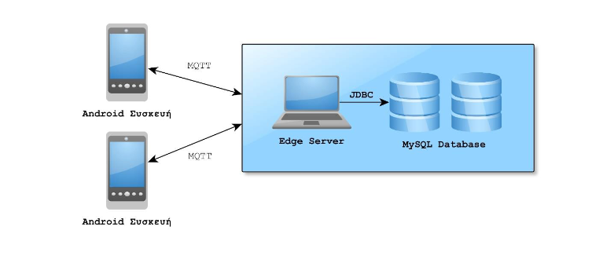

 
 <h1>Connected and Automated Driving</h1> 

 

**NOTE :** *There are separate README files for each application in the appropriate folder*

#### General Information
This project consists of an android application, and a server which communicate via the MQTT protocol. 
The android app takes advantage of the device's sensors in order to collect data and after their transmission
get trajectory, RSSI and throughput predictions. All the computations for the predictions, however are
not made in the android device itself. It is taken care of, by the server, which collects, saves and processes
the data from the android devices, and shares back the needed results.

#### Structural visualization
Here is a brief representation of the project's architecture.

 
 

#### What does this repo contain?
* **android_app** folder: contains a **Java Android** application which is build with **Gradle** 
* **server** folder: contains a **Maven** Project which builds a **Java Server**
