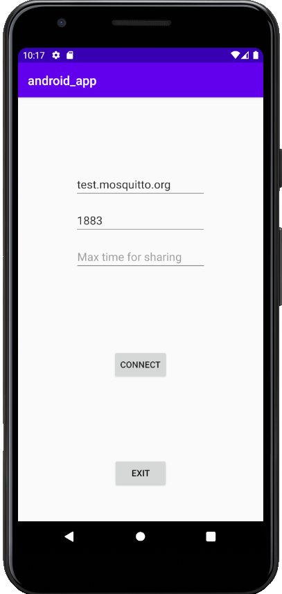
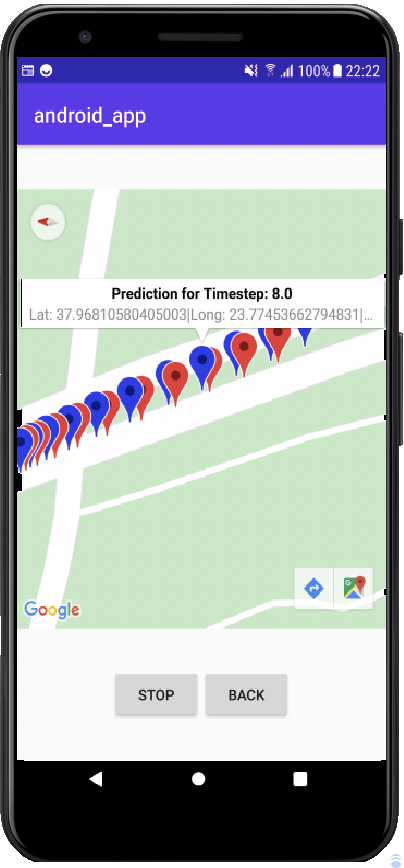

## Table of Contents
   <ol>
     <li><a href="#overview">Overview</a></li>
     <li><a href="#internet-connection">Checking internet Connection</a></li>
     <li><a href="#publishing-messages">Publishing messages</a></li>
     <li><a href="###showing-route-in-map">Showing route in map</a></li>
   </ol>

 

 

## Overview

This android application is supposed to be inside a car and transmit data derived from its sensors to a server, using
the MQTT protocol.
At this point though, the application provides a simulation of this concept as the data sent, are derived from a CSV file
which should be located in the root directory.
We provide a single page application interface, as seen below, which provides the ability to specify:
<ul>
<li>Mqtt Broker's URL</li>
<li>Mqtt Broker's PORT</li>
<li>Max time for transmitting data</li>
</ul>
Additionally there are some button which provide the ability to enable:
<ul>
<li>Connecting to broker and starting transmission of data</li>
<li>Stopping the transmission of data</li>
<li>Exiting the application</li>
</ul>
Finally, out application constantly checks for Internet connection to inform the user in case connection is lost.

 

## Checking internet connection

As previously stated, the application constantly checks for device's Internet connection. This happens with a custom 
BroadcastReceiver who overrides the onReceive function and when some network change occurs, checks for internet connection
and in case it is lost, user gets notified with a toast. The code for this feature, resides in the NetworkChangeReceiver.java
file under the connectivity package.

 

## Publishing messages

In order our application to have access to the CSV file that has been copied in the root directory we ask the user for
permission to access storage. That way we can have access to the information we want to send the server.
Our next step is to subscribe to the topic of the specific device which consists of the base URI ***karlialag/vehicle*** and the
identifier of the device according to the CSV provided. ***karlialag/vehicle/27*** is a case in point for such a topic.
Now that the unique topic has been specified we need to publish the messages. In order to achieve it
we execute an asyncTask. This thread that runs in the background iterates the whole CSV file(if user has specified max time
iterates N rows in the CSV) and after waiting for one second publishes the message to the specified topic. That way
we achieve a constant publishing time of one second.

## Showing route in map

Visual representation always helps the user understand the purpose of the application! This is the reason why, with the help
of Google Maps Api, we integrated a map in a new activity, which is presented to the user when he decides to connect to the server.
The map depicts the marks of the real route and the predicted marks for the next position(which is received by the server) with the
help of the following markers. 
<ul>
<li> Real position markers are red colored and share the position of the device(including information in their info window)</li>
<li> Predicted position markers are blue colored and share the predictions for the device's position which is computated in the edge server and communicated with a message to the specific topic</li>
</ul>

