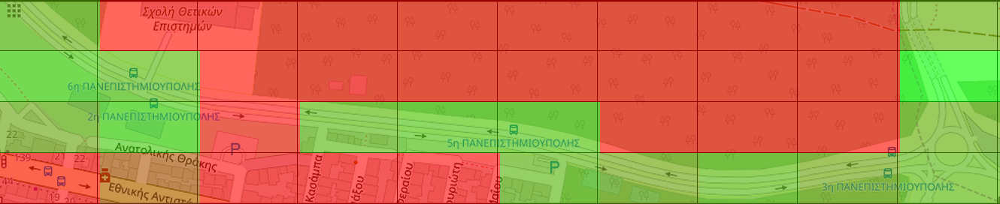

## Table of Contents
   <ol>
     <li>
       <a href="#run-the-program">Run the Program</a>
     </li>
     <li>
       <a href="#mqtt">MQTT</a>
       <ol>
        <li><a href="#thoughts">Thoughts</a></li>
       </ol>
     </li>
     <li><a href="#xml-to-csv">XML to CSV</a></li>
     <li><a href="#heatmaps">Heatmaps</a>
     <ol>
        <li><a href="#converting-map-in-grid">Converting map in grid</a></li>
        <li><a href="#colouring-process">Colouring Process</a></li>
     </ol>
     </li>
     <li><a href="#prediction">Prediction</a></li>
     <li><a href="#database">Database</a></li>
     <li><a href="#average-error">Average Error</a></li>
   </ol>

## Run the Program
 
 1. **Clone the repo**
 
    ```sh
    git clone https://anapgit.scanlab.gr/sdi1700045/uniProject.git
    ```
 2. **Navigate to Folder**
    ```sh
    cd server
    ```
 3. **Compilation**
    ```sh
    mvn clean package
    ```
 4. **Program execution**  
    ```sh
    java -jar target/server-1.0-SNAPSHOT-jar-with-dependencies.jar
    ```

<br/>

## MQTT

As it was depicted in the project's architecture the server needs to communicate with the Android devices using the MQTT protocol.
In order for the communication to be performed we create some topics for publishing and subscribing. The base topic for all the
purposes is "karlialag/vehicle". This is very helpful, because, each device needs its own topic, so it just has to append it's
unique id to the base topic. In our case, server, gets all the unique ids from the CSV files(using a simple regex) and subscribes
to the needed topics. The handling for the server's MQTT communications happens in the Mqtt package which also includes the
overriding of some Callback functions in order to present the messages arriving to the subscribed topics. It should be also noted,
that the brokers URL is configurable through a variable in the App.java file.

##### Thoughts

It passed our team's mind that server could subscribe to the topic "karlialag/vehicles/#" which would
result in accepting messages from all the android devices without specifying a specific id(This thought hasn't been explored
thoroughly and we stayed within the instructions lines).

<br/>

## XML to CSV

To convert XML files to CSV, we first store the needed XML attributes and the necessary CSV headers in a list.
Then for each tag we match the needed XML attribute to the appropriate CSV column.
It should also be noted, that the RSSI value is generated randomly according to the normal distribution(with nextGaussian() function).
Throughput uses this value according to the following formula.


When all values have been generated they are appended in the appropriate columns.

<br/>

## Heatmaps

##### Converting map in grid

Heatmaps are the color representation of the RSSI and Throughput data sent by vehicles. 
Firstly we create the grid.png image, which is a copy of the Map.png(provided) spit into same sized chunks.
Afterwards, we map each CSV row to the corresponding chunk(according to the longitude and latitude).
For each section in the map we calculate the average value and convert it to percentage value according to the given limits. 
The implementation of the above procedure is present in the HeatmapValues.java file.

##### Colouring Process

For the colouring procedure we use the JHeatChart library. According to the percentage 
value of each block we map it to a colour scale with green been the max value and red 
the minimum. This is how we create a coloured image without any map information. Our next 
step is to make the aforementioned transparent which is implemented in the OverlayImage class
As a final step we merge grid.png image with transparent one to get our final result.
The above procedure is followed for both RSSI and Throughput.


<p align="center"> 
 
</p>
</p>

<br/>

## Database

The application connects with an SQL database with the help of JDBC API. The
URL, username and password of the database are configured in the App.java file.
Initialize a table with the necessary fields and insert the corresponding values. 
Our database table hi's contains the following fields.

<ul>
<li>timestep</li>
<li>device_id</li>
<li>real_lat</li>
<li>real_long</li>
<li>predicted_lat</li>
<li>predicted_long</li>
<li>real_RSSI</li>
<li>real_throughput</li>
<li>predicted_RSSI</li>
<li>predicted_throughput</li>
</ul>

The whole implementation resides in the Database package.


## Prediction

When an android device starts sending the data, our server calculates the next geographical location of the vehicle 
and the quality of the network in the specified area. 
For the implementation of the above procedure we have created a formula that uses the received data to calculate the next position.
Once the above process is completed we send the predicted data back to the android device.
The formula is in the Prediction.java file

## Average Error

Once the sending of the data from the android device is completed, the server calculates the average divergence between the real and predicted position.

